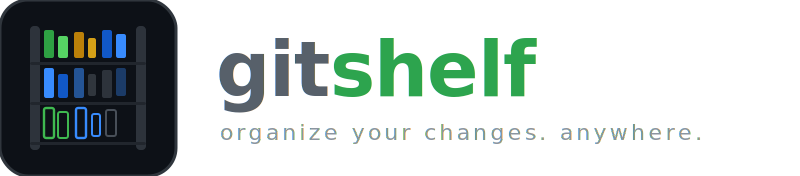
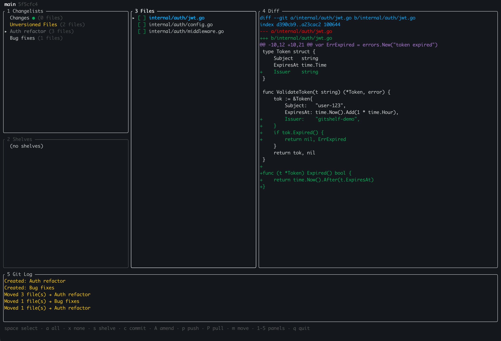
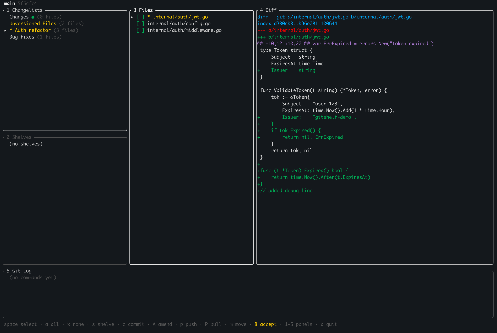
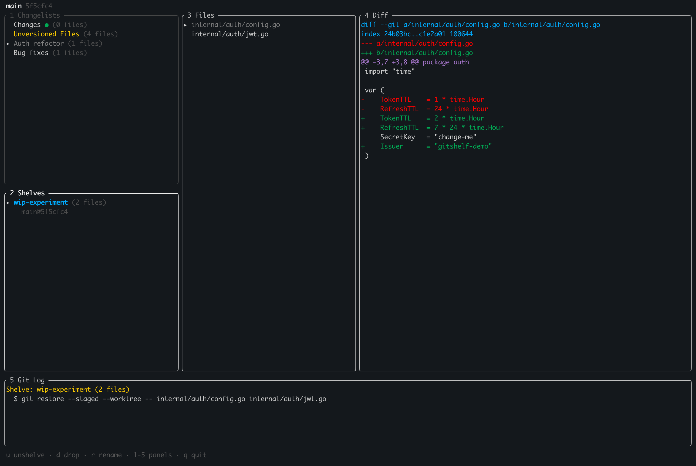

<picture>
  <source media="(prefers-color-scheme: dark)" srcset="docs/img/gitshelf-logo-dark.svg">
  <source media="(prefers-color-scheme: light)" srcset="docs/img/gitshelf-logo-light.svg">
  
</picture>

A terminal UI for organizing git changes into changelists and shelves — like IntelliJ IDEA's changelist system, but for any repo and any editor.


## The problem

You're working on a feature. You notice a typo. You fix it. Now your `git diff` mixes the typo fix with the feature work, and you have to mentally separate them at commit time — or worse, you commit them together.

IDEs like IntelliJ solve this with **changelists** — logical groups that let you organize your uncommitted changes by intent, not by time. But if you work in VS Code, Neovim, or any other editor, you don't get this.

**gitshelf** brings changelists and shelves to your terminal.

## What it does

- **Changelists** — Group your changed files by purpose. Commit "bug fix" and "refactor" separately, even if you worked on both at the same time.
- **Shelves** — Save changes for later without committing. Like `git stash`, but named, browsable, and you can shelve individual files instead of everything.
- **Selective commit** — Check the files you want, write a message, done. No staging gymnastics.
- **Dirty detection** — Know when files changed since you last looked at a changelist.
- **Push & pull** — Without leaving the TUI.
- **Full diff viewer** — Syntax-highlighted, scrollable, with word wrap toggle.
- **Worktree support** — Browse and manage changelists, shelves, and files across all your worktrees from a single instance.
- **Git log** — Every git command the app runs is visible. Nothing hidden.

## Install

### Homebrew (macOS & Linux)

```bash
brew tap ignaciotcrespo/tap
brew install gitshelf
```

### Go

```bash
go install github.com/ignaciotcrespo/gitshelf/cmd/gitshelf@latest
```

### Binary download

Grab the latest release for your platform from [GitHub Releases](https://github.com/ignaciotcrespo/gitshelf/releases).

## Usage

```bash
cd your-git-repo
gitshelf
```

That's it. The app detects the repo root automatically.

### Layout

Six panels: **Changelists**, **Shelves**, and **Worktrees** stacked on the left, **Files** in the center, **Diff** on the right, and **Git Log** spanning the full width at the bottom.



### Dirty detection in action

When files change after being assigned to a changelist, they're marked with `*` and highlighted in yellow. Press `B` to accept the current state as the new baseline.



### Shelves

Save changes for later without committing. Browse shelf contents and diffs before restoring.



### Worktrees

If you use [git worktrees](https://git-scm.com/docs/git-worktree), gitshelf lets you manage all of them from wherever you launched it. Press `6` to open the Worktrees panel, then navigate with arrow keys — the changelists, shelves, files, and diffs update automatically as you move between worktrees.

Each worktree has its own independent `.gitshelf/` directory, so changelists and shelves are completely isolated. You never have to worry about one worktree's organization leaking into another.

**What you can do:**

- **Manage changelists and shelves per worktree.** Navigate to any worktree and see its changelists, shelves, and uncommitted files — all without leaving the app or `cd`-ing between directories.
- **Copy changelists between worktrees.** Press `W` to copy a changelist, navigate to another worktree, press `V` to paste. Three paste modes:
  - **Full content** — copies the actual file contents from the source worktree
  - **Apply diff** — generates a patch from the source and applies it
  - **Only changelist** — just creates the changelist grouping without modifying files (useful when both worktrees already have the same files changed)

### Panels

The UI has six panels, accessible by number keys:

| # | Panel | Shows |
|---|-------|-------|
| 1 | Changelists | Your logical groups of changes |
| 2 | Shelves | Saved change sets (like named stashes) |
| 3 | Files | Files in the selected changelist or shelf |
| 4 | Diff | Diff of the selected file |
| 5 | Git Log | Every git command the app executed |
| 6 | Worktrees | All worktrees — navigate to browse their changelists and shelves |

Press `4` or `5` to cycle a panel through normal → maximized → hidden. Press `6` to toggle the Worktrees panel between normal and minimized.

### Keyboard shortcuts

See [docs/keybindings.md](docs/keybindings.md) for the full list. Press `?` in the app for an in-app reference.

Quick overview: `n` new changelist, `space` select files, `c` commit, `s` shelve, `m` move files, `p`/`P` push/pull, `y` copy patch.

## Not a git client

gitshelf is **not** a git client. It's a change organizer — it groups your uncommitted files into logical changelists and lets you shelve them for later. The commit, amend, push, and pull commands are there for convenience so you don't have to leave the TUI for basic operations.

For anything beyond that — merge conflicts, rebasing, cherry-picking, bisecting, or any advanced git workflow — use a proper git tool like [lazygit](https://github.com/jesseduffield/lazygit), [tig](https://github.com/jonas/tig), or the git CLI directly.

## How it works

See [docs/design.md](docs/design.md) for details on changelists, shelves, dirty detection, data storage, and design decisions.

## Building from source

```bash
git clone https://github.com/ignaciotcrespo/gitshelf.git
cd gitshelf
./build.sh
./gitshelf --version
```

## License

[MIT](LICENSE)

## Credits

Built with [Bubbletea](https://github.com/charmbracelet/bubbletea) by Charm. Inspired by IntelliJ IDEA's changelist system and [lazygit](https://github.com/jesseduffield/lazygit)'s approach to making git approachable from the terminal.
