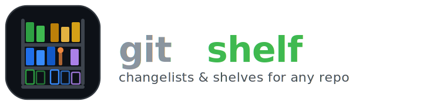

A terminal UI for organizing git changes into changelists and shelves — like IntelliJ IDEA's changelist system, but for any repo and any editor.


## The problem

You're working on a feature. You notice a typo. You fix it. Now your `git diff` mixes the typo fix with the feature work, and you have to mentally separate them at commit time — or worse, you commit them together.

IDEs like IntelliJ solve this with **changelists** — logical groups that let you organize your uncommitted changes by intent, not by time. But if you work in VS Code, Neovim, or any other editor, you don't get this.

**gitshelf** brings changelists and shelves to your terminal.

## What it does

- **Changelists** — Group your changed files by purpose. Commit "bug fix" and "refactor" separately, even if you worked on both at the same time.
- **Shelves** — Save changes for later without committing. Like `git stash`, but named, browsable, and you can shelve individual files instead of everything.
- **Selective commit** — Check the files you want, write a message, done. No staging gymnastics.
- **Dirty detection** — Know when files changed since you last looked at a changelist.
- **Push & pull** — Without leaving the TUI.
- **Full diff viewer** — Syntax-highlighted, scrollable, with word wrap toggle.
- **Git log** — Every git command the app runs is visible. Nothing hidden.

## Install

### Homebrew (macOS & Linux)

```bash
brew tap ignaciotcrespo/tap
brew install gitshelf
```

### Go

```bash
go install github.com/ignaciotcrespo/gitshelf/cmd/gitshelf@latest
```

### Binary download

Grab the latest release for your platform from [GitHub Releases](https://github.com/ignaciotcrespo/gitshelf/releases).

## Usage

```bash
cd your-git-repo
gitshelf
```

That's it. The app detects the repo root automatically.

### Layout

Five panels: **Changelists** and **Shelves** stacked on the left, **Files** in the center, **Diff** on the right, and **Git Log** spanning the full width at the bottom.


### Dirty detection in action

When files change after being assigned to a changelist, they're marked with `*` and highlighted in yellow. Press `B` to accept the current state as the new baseline.


### Shelves

Save changes for later without committing. Browse shelf contents and diffs before restoring.


### Panels

The UI has five panels, accessible by number keys:

| # | Panel | Shows |
|---|-------|-------|
| 1 | Changelists | Your logical groups of changes |
| 2 | Shelves | Saved change sets (like named stashes) |
| 3 | Files | Files in the selected changelist or shelf |
| 4 | Diff | Diff of the selected file |
| 5 | Git Log | Every git command the app executed |

Press `4` or `5` to cycle a panel through normal → maximized → hidden.

### Keyboard shortcuts

**Navigation**

| Key | Action |
|-----|--------|
| `1`-`5` | Jump to panel |
| `tab` / `shift+tab` | Cycle between panels |
| `j` / `k` or `↑` / `↓` | Move cursor |
| `h` / `l` or `←` / `→` | Scroll diff horizontally |
| `w` | Toggle diff word wrap |
| `enter` | Drill into files / diff |
| `q` | Quit |

**Changelists** (panel 1)

| Key | Action |
|-----|--------|
| `n` | New changelist |
| `r` | Rename changelist |
| `d` | Delete changelist |
| `a` | Set as active (new changes go here) |
| `s` | Shelve all files in changelist |
| `B` | Accept dirty changes as new baseline |
| `y` | Copy changelist diff as patch to clipboard |

**Files** (panel 3)

| Key | Action |
|-----|--------|
| `space` | Toggle file selection |
| `a` | Select all |
| `x` | Deselect all |
| `c` | Commit selected files |
| `A` | Amend last commit with selected files |
| `s` | Shelve selected files |
| `m` | Move file(s) to another changelist |
| `y` | Copy selected file(s) diff as patch to clipboard |

**Shelves** (panel 2)

| Key | Action |
|-----|--------|
| `u` | Unshelve (restore changes to working tree) |
| `r` | Rename shelf |
| `d` | Drop shelf |
| `y` | Copy shelf patch to clipboard |

**Diff** (panel 4)

| Key | Action |
|-----|--------|
| `y` | Copy visible diff to clipboard |

**Remote**

| Key | Action |
|-----|--------|
| `p` | Push |
| `P` | Pull |

## Not a git client

gitshelf is **not** a git client. It's a change organizer — it groups your uncommitted files into logical changelists and lets you shelve them for later. The commit, amend, push, and pull commands are there for convenience so you don't have to leave the TUI for basic operations.

For anything beyond that — merge conflicts, rebasing, cherry-picking, bisecting, or any advanced git workflow — use a proper git tool like [lazygit](https://github.com/jesseduffield/lazygit), [tig](https://github.com/jonas/tig), or the git CLI directly.

## How it works

See [docs/design.md](docs/design.md) for details on changelists, shelves, dirty detection, data storage, and design decisions.

## Building from source

```bash
git clone https://github.com/ignaciotcrespo/gitshelf.git
cd gitshelf
./build.sh
./gitshelf --version
```

## License

[MIT](LICENSE)

## Credits

Built with [Bubbletea](https://github.com/charmbracelet/bubbletea) by Charm. Inspired by IntelliJ IDEA's changelist system and [lazygit](https://github.com/jesseduffield/lazygit)'s approach to making git approachable from the terminal.
