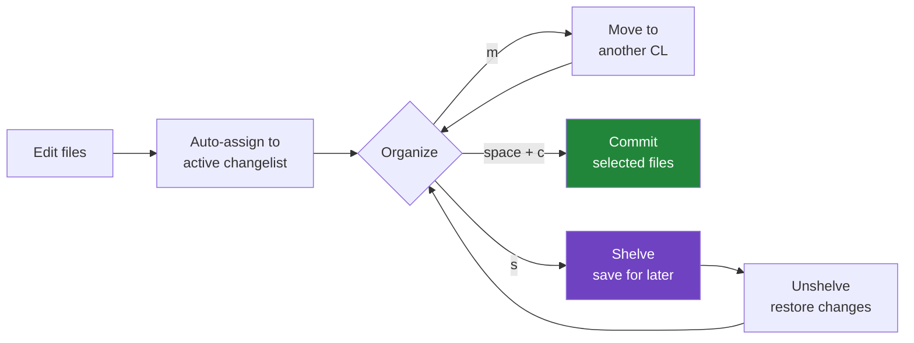
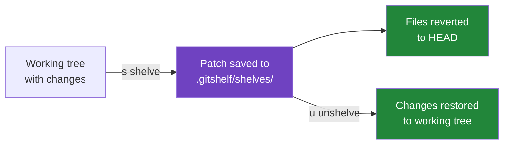

# Design

## How changelists work

When you run gitshelf, it scans your working tree for changes and assigns them:

- **Tracked changes** (modified, staged, deleted) go to the **active changelist** (default: "Changes")
- **Untracked files** go to "Unversioned Files"

You create new changelists with `n` and move files between them with `m`. When you commit with `c`, only the selected files from the current changelist are committed — everything else stays untouched.

Changelists persist in `.gitshelf/changelists.json` in your repo root. Add `.gitshelf/` to your `.gitignore` if you don't want to share them with your team, or commit it if you do.

### Changelist lifecycle



### File-level changelists, not hunk-level

IntelliJ IDEA assigns individual *hunks* (chunks within a file) to changelists. gitshelf works at the **file level** — each file belongs to exactly one changelist.

This is a deliberate trade-off. Hunk-level splitting is powerful but fragile: hunks shift as you edit, and a single save can rearrange which hunk belongs where. File-level assignment is stable, predictable, and maps directly to how `git commit -- <files>` works under the hood.

In practice, most changes that belong together are already in separate files. When they're not, you can still commit selectively — just pick which files to include from the changelist.

### Dirty detection

Here's the scenario: you organize files into a changelist called "Auth refactor", then keep working in your editor. Later you come back to gitshelf — but some of those files now have *different* changes than when you assigned them. Maybe you added a debug line, or a colleague's rebase changed the diff. The changelist name says "Auth refactor" but the contents have drifted.

gitshelf solves this with **dirty detection**. When a file is assigned to a user-created changelist, gitshelf stores a hash of its diff. On each refresh, it compares the current diff hash against the stored one. If they diverge:

- The **file** is marked dirty with a `*` prefix and highlighted in yellow
- The **changelist** is also marked dirty, so you can spot the problem from the CL panel without drilling into files
- Press `B` to **accept** the current state as the new baseline — this means "I've reviewed the changes, they're fine"

This gives you confidence that what you're about to commit is what you *intended* to commit, not something that silently changed underneath you.

## How shelves work

Shelves are like named, browsable stashes:



Unlike `git stash`, you can:
- Shelve specific files instead of everything
- Name your shelves for easy identification
- Browse shelf contents and diffs before unshelving
- Keep multiple shelves organized by purpose

## Transparency

Every git command gitshelf runs is logged in the **Git Log** panel (press `5`). You can always see exactly what happened. The app never runs hidden git operations.

## Data storage

gitshelf stores its data in `.gitshelf/` at the root of your repository:

```
.gitshelf/
├── changelists.json          # changelist assignments
└── shelves/
    └── my-shelf/
        ├── metadata.json     # shelf info (name, branch, files)
        └── patch.diff        # the actual changes
```

No global config, no daemon, no background process. Everything is local to the repo.
